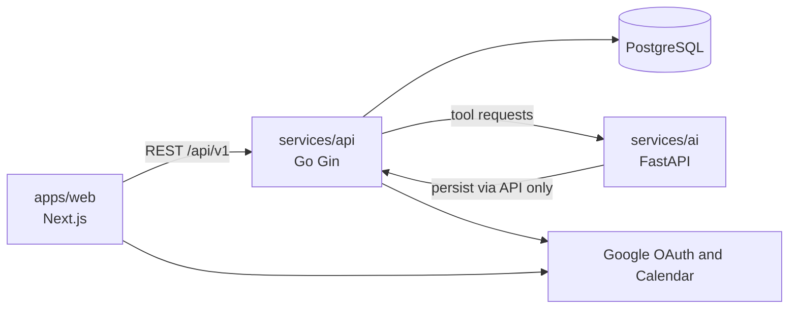
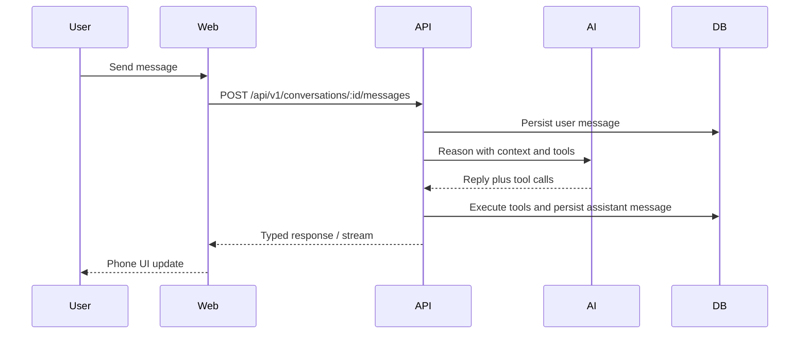
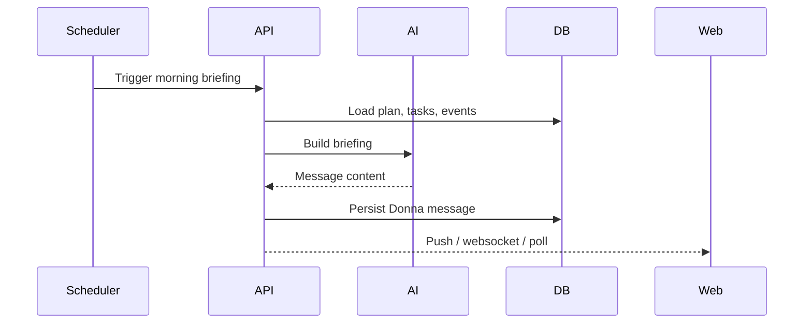
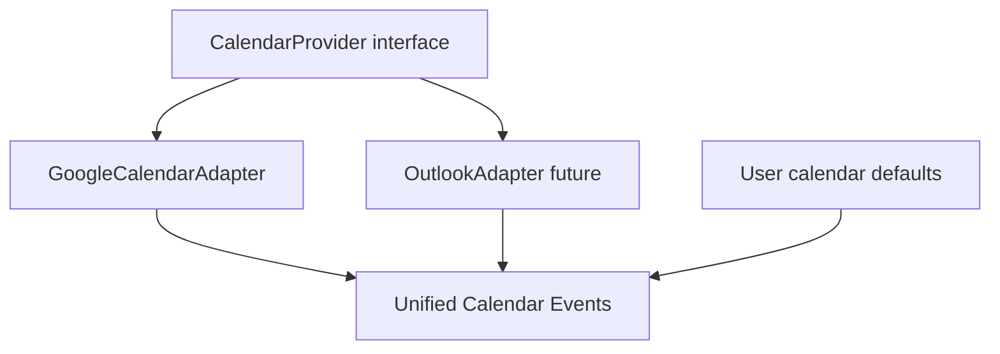

# Donna Architecture

## System overview



## Ownership boundaries

| Layer | Owns | Does not own |
| --- | --- | --- |
| `apps/web` | UI, client state, presentation | Business rules, DB, LLM calls |
| `services/api` | Auth, CRUD, providers, scheduling, orchestration | Prompt engineering, embeddings |
| `services/ai` | Intent, planning, memory retrieval, tool decisions, replies | Direct DB writes |
| PostgreSQL | Source of truth | — |

**Rule:** AI reasons. Backend executes. Database stores.

## Request paths

### User chat



### Proactive check-in



## API design

- Versioned REST under `/api/v1`
- Handlers validate and map HTTP only
- Services own business logic
- Repositories own SQL / migrations consumers
- Typed JSON request and response contracts live in `packages/types`

## Calendar unification



Phase 1 ships Google only. All calendar code goes through a provider interface so Outlook/Apple can plug in later.

## Auth model

- Google OAuth creates a **Donna account** (identity).
- Integration connections are separate rows (`connections`).
- Login Google account is not automatically a calendar connection.
- Session tokens issued by API; web never stores provider refresh tokens in localStorage.

## Frontend feature layout

Each feature follows:

```text
Feature/
  Feature.tsx        # UI only
  Feature.logic.ts   # hooks, handlers
  Feature.styles.ts  # Tailwind class constants
  Feature.types.ts   # local types
  index.ts
```

Dashboard left column = widgets. Right column = persistent Phone chat shell.

## AI tool calling

AI may request tools such as:

- `create_task`, `complete_task`
- `create_event`, `update_event`, `delete_event`
- `save_daily_plan`, `save_memory`
- `search_memory`

API validates permissions, executes via services, returns structured results to AI for the final user-facing reply.

## Packages

| Package | Purpose |
| --- | --- |
| `packages/types` | Shared API DTOs / OpenAPI-derived types |
| `packages/ui` | Shared presentational primitives beyond shadcn |
| `packages/shared` | Pure helpers shared by web (no server secrets) |

## Infra

`infra/docker` runs Postgres (and later Redis for jobs/push fan-out). Local compose brings up DB + API + AI + web.
