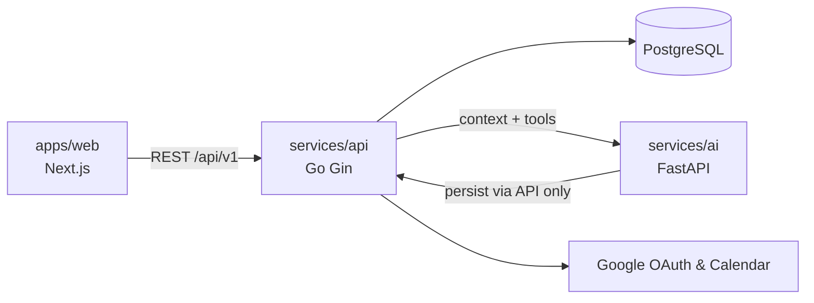
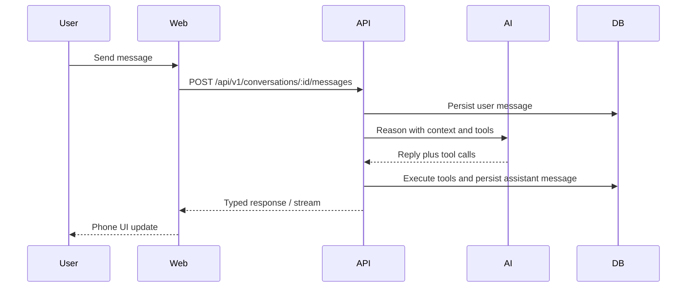

# Donna — System Design

| | |
| --- | --- |
| **Version** | 1.0 |
| **Author** | Aryan Thacker |
| **Status** | Phase 1 |
| **Related** | [PRD](./PRD.md) · [Architecture](./ARCHITECTURE.md) · [Phase 1 Plan](./PHASE1_PLAN.md) · [Engineering Standards](./CURSOR_RULES.md) |

---

## Table of Contents

1. [Overview](#1-overview)
2. [Design Principles](#2-design-principles)
3. [High-Level Architecture](#3-high-level-architecture)
4. [Application Layers](#4-application-layers)
5. [Monorepo Structure](#5-monorepo-structure)
6. [Frontend Architecture](#6-frontend-architecture)
7. [Backend Architecture](#7-backend-architecture)
8. [AI Service](#8-ai-service)
9. [Database](#9-database)
10. [Authentication](#10-authentication)
11. [Connected Accounts](#11-connected-accounts)
12. [Calendar Architecture](#12-calendar-architecture)
13. [Chat Flow](#13-chat-flow)
14. [Dashboard Flow](#14-dashboard-flow)
15. [AI Decision & Tool Calling](#15-ai-decision--tool-calling)
16. [Reminder Architecture](#16-reminder-architecture)
17. [Memory Architecture](#17-memory-architecture)
18. [Notification Flow](#18-notification-flow)
19. [Error Handling & Logging](#19-error-handling--logging)
20. [Security](#20-security)
21. [Scalability & Future Components](#21-scalability--future-components)
22. [Core Philosophy](#22-core-philosophy)

---

## 1. Overview

Donna is a **Personal AI Operating System**.

Unlike traditional chatbots, Donna is an event-driven productivity platform where AI is one of several services—not the application itself.

The system is designed around strict separation of concerns:

| Layer | Role |
| --- | --- |
| Frontend | Presentation and interaction |
| Backend | Business logic and orchestration |
| AI | Reasoning only |
| Database | Source of truth |
| External providers | Integrations (Calendar, OAuth, etc.) |

**The AI never directly modifies application state.** All writes happen through backend APIs.

> **Invariant:** AI reasons. Backend executes. Database stores.

---

## 2. Design Principles

1. **AI never owns business logic.** Product rules live in Go services, not prompts.
2. **Backend owns all application state.** Persistence and mutations go through the API.
3. **Every external service is replaceable.** Providers implement interfaces; adapters are swappable.
4. **Components are independently deployable.** Web, API, and AI scale and ship separately.
5. **Every module has one responsibility.** SOLID; no God services or dump files.
6. **Multi-user from Day 1.** Tenancy and auth are first-class, not bolted on later.
7. **Future integrations without breaking changes.** New providers plug in; existing contracts stay stable.

---

## 3. High-Level Architecture

```text
                          Browser
                              │
                              │
                     Next.js Frontend
                              │
                     HTTPS REST /api/v1
                              │
                        Go API (Gin)
                              │
        ┌─────────────────────┼──────────────────────┐
        │                     │                      │
 Google APIs          Python AI Service         PostgreSQL
(Calendar, OAuth)         (FastAPI)            (Supabase)
        │                     │                      │
        └────────────── Future Services ─────────────┘
                  Redis · Background Workers
                  Push Notifications · OpenClaw
```



| Component | Technology | Phase 1 scope |
| --- | --- | --- |
| Web | Next.js, React, TypeScript, Tailwind, shadcn/ui | Dashboard + Phone UI |
| API | Go, Gin | Auth, CRUD, orchestration, Google Calendar |
| AI | Python, FastAPI | Intent, planning, tools, replies, embeddings |
| DB | Supabase PostgreSQL (+ pgvector) | Full domain schema |
| Integrations | Google OAuth + Google Calendar | No Gmail, Drive, GitHub, Voice, Telegram, WhatsApp |

---

## 4. Application Layers

```text
Frontend
    ↓
API Layer          (handlers — HTTP only)
    ↓
Business Logic     (services)
    ↓
Repository Layer   (data access)
    ↓
Database
```

The AI service sits **beside** the backend. It is called only when reasoning is required. It never sits on the write path to the database.

---

## 5. Monorepo Structure

```text
apps/
  web/                 # Next.js UI

services/
  api/                 # Go Gin API — system of record for mutations
  ai/                  # FastAPI — reasoning, prompts, embeddings

packages/
  ui/                  # Shared presentational primitives
  types/               # Shared API DTOs / contracts
  shared/              # Pure helpers (no secrets)

docs/                  # PRD, system design, plans, personality
infra/
  docker/              # Local Postgres (later Redis, workers)
```

Typed request/response contracts live in `packages/types` and are shared by web and API consumers.

---

## 6. Frontend Architecture

### Stack

- Next.js (App Router)
- React + TypeScript
- Tailwind CSS
- shadcn/ui

### Responsibilities

- UI rendering and layout
- Client state for presentation
- User interaction
- Authentication flow (OAuth redirect / session cookie handling)
- Dashboard widgets
- Phone chat shell

### Non-responsibilities

- Business rules
- Direct database access
- Direct LLM calls
- Provider token storage in `localStorage`

All operations go through backend APIs. UI components do not call the network; feature logic modules own data fetching.

### Feature folder convention

```text
Feature/
  Feature.tsx         # UI only
  Feature.logic.ts    # hooks, handlers, API calls
  Feature.styles.ts   # Tailwind class constants
  Feature.types.ts    # local types
  index.ts
```

### Layout

- **Left:** dashboard widgets (summary, calendar, tasks, goals, backlog, insights)
- **Right:** persistent Phone chat shell (always visible)

---

## 7. Backend Architecture

### Stack

- Language: Go
- Framework: Gin
- API surface: versioned REST under `/api/v1`

### Layering

```text
Handler → Service → Repository → Database
```

| Layer | Owns | Does not own |
| --- | --- | --- |
| Handler | Validation, status codes, DTO mapping | Business rules, SQL |
| Service | Business logic, orchestration, provider calls | HTTP details, raw SQL |
| Repository | Persistence, queries | Product rules |

### Domain responsibilities (Phase 1)

- Authentication & sessions
- Profiles & settings
- Connections & calendar sources
- Calendar sync / CRUD via providers
- Tasks, notes, goals
- Daily plans & reviews
- Conversations & messages
- Memory CRUD (storage; AI retrieves)
- Notifications
- Dashboard aggregation
- Scheduling triggers (briefings, check-ins)

The backend is the **heart of Donna**—the only service allowed to mutate application state.

---

## 8. AI Service

### Stack

- Language: Python
- Framework: FastAPI

### Responsibilities

- Natural language understanding & intent detection
- Planning and coaching tone
- Conversation generation (streaming when supported)
- Summaries and reflections
- Tool selection (structured schemas)
- Prompt management (versioned)
- Embeddings & memory retrieval (read path via API-backed store)

### Non-responsibilities

- Direct database writes
- Calling Google / Microsoft / Slack APIs
- Encoding product CRUD rules in prompts

### Write path

```text
Frontend → Backend → AI → Backend → Database
```

The AI returns replies and optional tool requests. The API validates permissions, executes tools via services, persists results, and returns the final response to the client.

---

## 9. Database

### Technology

Supabase PostgreSQL with **pgvector** for future semantic search.

### Core entities

Canonical vocabulary and ownership: **[DOMAIN_MODEL.md](./DOMAIN_MODEL.md)**.  
Logical fields, constraints, indexes (no SQL): **[DATA_MODEL.md](./DATA_MODEL.md)**.  
Persistence conventions: **[DATABASE.md](./DATABASE.md)**.

| Domain | Concepts (not final table DDL) |
| --- | --- |
| Identity | User, profile, settings, preferences |
| Integrations | Connected accounts, calendar sources |
| Calendar | Unified calendar events (Donna-owned) |
| Work | Tasks, goals, notes, reminders |
| Rhythm | Daily plans, daily reviews, check-ins |
| Chat | Conversations, messages |
| Memory | Memories (+ embeddings later) |
| Alerts | Notifications |
| Platform | Scheduler jobs, audit logs, AI usage |

PostgreSQL is the **source of truth**. The AI service does not hold authoritative state.

---

## 10. Authentication

```text
User
  ↓
Google OAuth
  ↓
Backend verifies token
  ↓
Donna account created / linked
  ↓
JWT / secure session cookie
  ↓
Frontend authenticated
```

### Rules

- Google login creates **identity** only (a Donna account).
- Login Google account is **not** automatically a calendar connection.
- Session tokens are issued by the API.
- Provider refresh tokens never live in frontend storage.

---

## 11. Connected Accounts

```text
Donna Account
  ↓
Connections
  ↓
Google Personal · Google Work · Microsoft · Slack · GitHub · Notion · …
```

Every connection is an independent row. Phase 1 implements **Google** only; the model supports additional providers without schema redesign.

---

## 12. Calendar Architecture

### Unification model

```text
External Calendars
  ↓
Calendar Connectors (adapters)
  ↓
Unified Calendar Events
  ↓
Donna (services + AI tools)
```

Donna never reasons about raw provider APIs. It sees **unified events**.

### Provider interface

Each adapter implements:

- Get Events
- Create Event
- Update Event
- Delete Event

Phase 1 ships `GoogleCalendarAdapter`. Outlook / Apple plug in later behind the same interface.

### Default calendar routing

Each user configures:

| Default | Typical use |
| --- | --- |
| Personal | Social, family, personal errands |
| Work | Meetings, professional blocks |
| Reminder | Lightweight reminders |

Examples:

| User intent | Target |
| --- | --- |
| “Create meeting tomorrow” | Work calendar (default) |
| “Dinner with family” | Personal calendar (default) |
| “Create event in Office calendar” | Explicit override |

---

## 13. Chat Flow

```text
User → Phone UI → Backend → Conversation Service
                         → Context Builder
                         → AI
                         → Response → Frontend
```

### Context builder inputs (only what is relevant)

- Calendar (near-term)
- Tasks & goals
- Relevant memories
- Conversation history (windowed)
- Settings / preferences

### Sequence



Proactive flows (morning briefing, midday check-in, evening reflection) are triggered by the scheduler hitting the API—not by the AI polling the database.

---

## 14. Dashboard Flow

```text
Frontend → GET /api/v1/dashboard
              ↓
         Backend aggregates
              ↓
         Tasks · Meetings · Goals · Notifications · Insights
              ↓
         Single response
```

The frontend does **not** fan out multiple widget requests for the initial dashboard load. Aggregation stays on the server so widgets stay consistent and the client stays thin.

---

## 15. AI Decision & Tool Calling

### Decision flow

```text
User Message
  ↓
Intent Detection
  ↓
Requires reasoning?
  ├─ No  → Backend executes directly
  └─ Yes → AI → Tool Selection → Backend executes tool
                → AI formats response → Frontend
```

Simple, deterministic operations can short-circuit without an LLM round-trip when the API already understands the request (e.g. explicit CRUD from the UI).

### Tool calling

The AI **never** calls Google APIs (or any provider) directly.

```text
AI → Tool Request → Backend → Calendar/Task/… Service → Provider API
                 ← structured result ←
AI → User-facing reply
```

Example tools (Phase 1):

- `create_task`, `complete_task`
- `create_event`, `update_event`, `delete_event`
- `save_daily_plan`, `save_memory`
- `search_memory`

API validates authz, executes via services, returns structured results. This keeps the AI **stateless** with respect to application data.

---

## 16. Reminder Architecture

```text
User creates reminder
  ↓
Schedule stored (DB)
  ↓
Background Worker (future / Phase 1 lightweight cron)
  ↓
Due? → Notification Service → Browser Push
```

### Future channels

Telegram · WhatsApp · Voice · Email · OpenClaw

Phase 1 uses browser push. Channel selection stays behind the notification service so new transports do not change domain logic.

---

## 17. Memory Architecture

```text
Conversation
  ↓
Memory Extractor (AI proposes)
  ↓
Relevant? → Backend stores Memory
  ↓
Vector Index (pgvector)
  ↓
Future / Phase 1 retrieval via search_memory tool
```

Memories capture durable context:

- Projects, people, goals
- Preferences and habits
- Ideas and commitments

Storage and deletion always go through the API. The AI proposes; the backend persists.

---

## 18. Notification Flow

```text
Trigger (scheduler / event / reminder)
  ↓
Notification Service
  ↓
Channel Selection
  ↓
Browser Push  (Phase 1)
```

Examples: morning briefing, meeting reminders, midday check-in, evening reflection.

---

## 19. Error Handling & Logging

### Errors

```text
Frontend ← API Error ← Backend logs (structured)
         ← User-friendly message
         ← Retry when safe / idempotent
```

Never swallow errors. Map internal failures to safe client messages. Do not leak stack traces or secrets.

### Logging

Every request should carry:

| Field | Purpose |
| --- | --- |
| Request ID | Correlation across services |
| User ID | Tenant context (when authenticated) |
| Duration | Latency |
| Status | Outcome |
| Errors | Failure detail for ops |

Use structured logging only. No `console.log` / `fmt.Println` in production paths.

**Source of truth:** [OBSERVABILITY.md](./OBSERVABILITY.md) — Logger Factory, request IDs, levels, AI usage, audit, and the metrics/tracing roadmap.

---

## 20. Security

| Control | Practice |
| --- | --- |
| Auth | JWT / secure session cookies |
| Identity | Google OAuth for Donna accounts |
| Secrets | Environment variables only |
| Transport | HTTPS in deployed environments |
| Input | Validate every request at the handler |
| Abuse | Rate limiting |
| Client | Never expose provider secrets or refresh tokens |

---

## 21. Scalability & Future Components

### Already supported by design

- Multiple users
- Multiple AI providers (swap behind the AI service)
- Multiple calendar providers
- Multiple notification channels
- Multiple chat surfaces
- Horizontal API scaling
- Agentic workflows (tools + orchestrated services)

### Future components

| Component | Role |
| --- | --- |
| Redis | Cache, queues, fan-out |
| Background Workers | Reminders, sync, digests |
| OpenClaw | Extended agent runtime |
| Document Search / OCR | Knowledge ingest |
| Knowledge Graph | Relationship-aware memory |
| Workflow Engine | Multi-step automations |
| Voice Processing | Speech in/out |
| Planner / Memory Agents | Specialized reasoning loops |

### Explicitly out of Phase 1

Gmail, Drive, GitHub, Voice, Telegram, WhatsApp, OpenClaw, and non-Google calendar providers.

---

## 22. Core Philosophy

Donna is **not** an AI application.

Donna is a **software platform** that uses AI where reasoning adds value.

| Concern | Owner |
| --- | --- |
| Business logic | Backend |
| Data | Database |
| Intelligence | AI |
| Presentation | Frontend |

This separation keeps the system scalable, testable, maintainable, and cost-efficient—and it keeps Donna feeling like a trusted assistant rather than a chat wrapper around an LLM.
